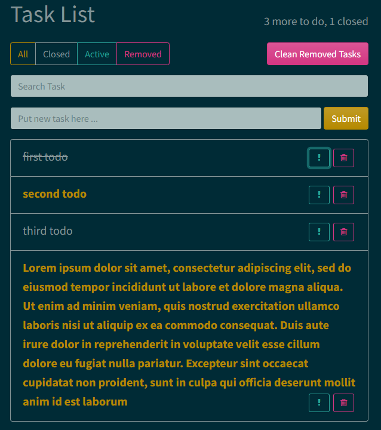

# ToDo App with Hooks using TypeScript

## Functional

This project is a list with different tasks. Quantity of all tasks and closed tasks shown in up-header.

### Filter Panel

Task list could be filtered by using `"All"`/`"Closed"`/`"Active"`/`"Removed"` buttons in top of application. In this case just filtered tasks would be shown in the list.

### Search Panel

Task could be found by using `"Search Task"` input field.
Letter case doesn't matter for matching.

### Add new Task Panel

New task could be added by `"Put new task here..."` field and this task would be added into all task list.

### Task List

Any task could be:
- mark like Important by using **"!"** button in each task. If task marked like important it have bold yellow color.

- deleted from main list by using **"Trash"** button im each task.

- mark like closed or done by click on each title of task. If task marked like closer/done it have crossed out line through tasks title.

### Clean Removed Tasks

Removed tasks could be turn back by using **"Back Arrow"** button in "Removed" list for required task.

All removed tasks could be cleaned from project by using `"Clean Removed Tasks"`.
